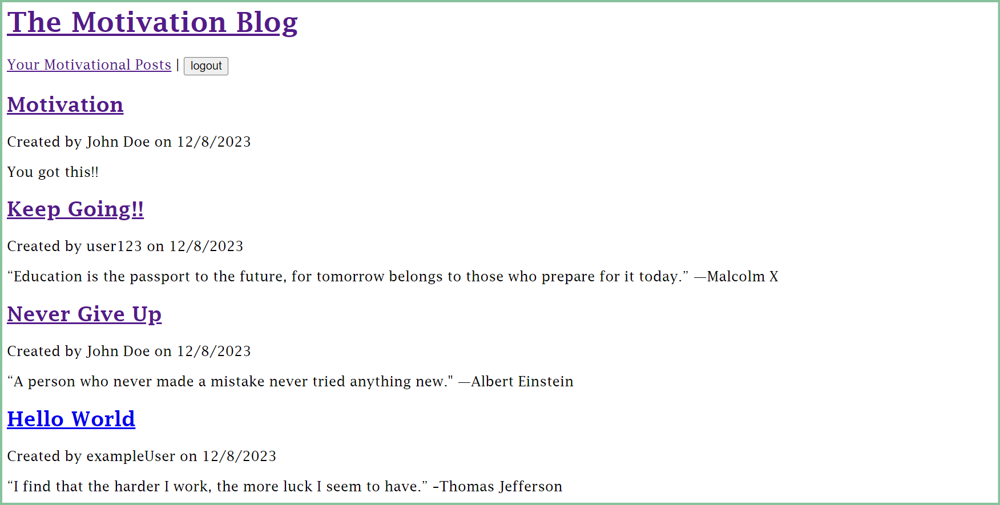
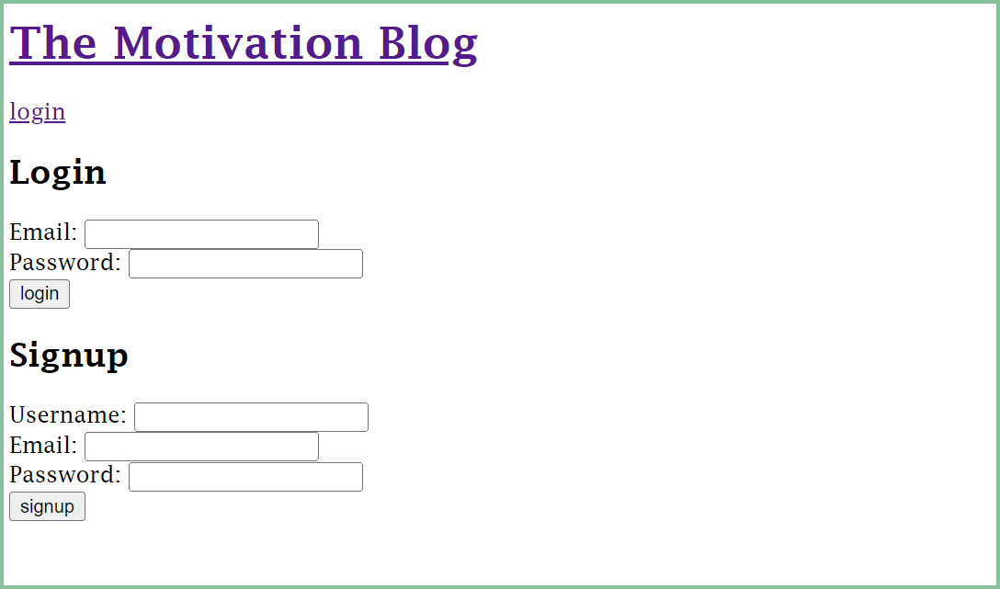
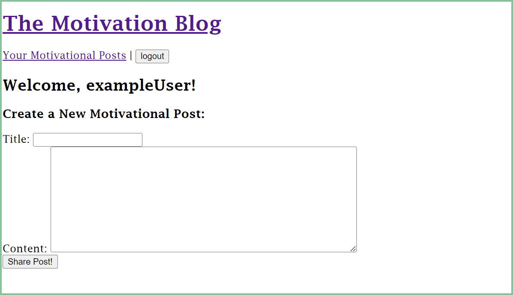

# The Motivation Blog 

  

  ## Description 
  This website has been designed with the aim of providing a dedicated space for individuals seeking motivation and inspiration. Its purpose is to serve as a go-to platform where people can find the encouragement they need to stay motivated. Additionally, users are given the opportunity to share their own uplifting words, allowing others to benefit from their positive messages.

  ## Table Of Contents
  - [Installation](#installation)
  - [Usage](#usage)
  - [Walk Through](#walk-through)
  - [Questions](#questions)

  ## Installation
  To install this application you must:
  1. Make sure you have both Node.js and MySQL installed
  2. Clone Repo
  3. Open repo in perffered text editor 

  ## Usage 
  1. Open a new terminal in the repo and 
  2. Type `npm install` in terminal to install Node into repo
  3. Once installed, type `mysql -u root -p` and enter your password
  4. Type `SOURCE db/schema.sql` to set up database and tables
  5. Type `exit` to exit MySQL
  6. Once user exits MySQL, type `npm run seed` to seed database
  7. When finished, type `npm run start` to start server
  8. User can now goo to brower and open `localhost:3001` to view websites full functionality

  ## Walk Through
  
  Once user is on website, it should look similar to the image displayed below,
  

  To signup or login, user can click on `login` button displayed below the websites title,
  

  Once user has signed up or logged in, site will then allow user to create a post,
  

  ## Questions 
  Feel free to contact me directly at standridgealison@gmail.com for more information about this project. 
  To check out my other github repositories click the link
  https://github.com/astand02.
